# Robot Arm Simulator with Foundry Local LLM Brain

A PyBullet robot-arm simulation controlled by natural-language commands.
The "brain" runs **entirely on-device** via [Foundry Local](https://foundrylocal.ai) –
no cloud APIs, no API keys.

## Architecture

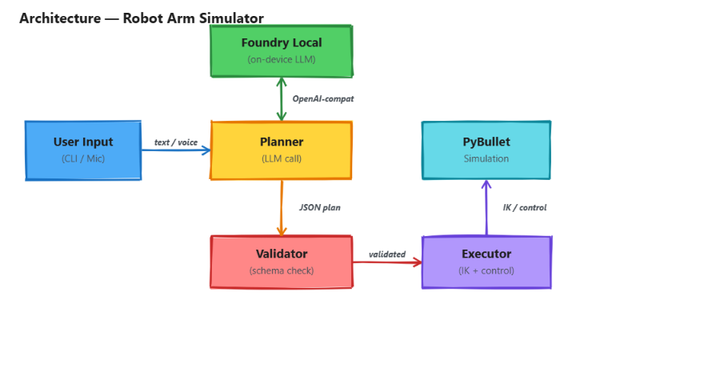

The system uses the **Microsoft Agent Framework** to orchestrate multiple
specialised agents that collaborate to translate natural language into safe,
validated robot actions:

| Agent | Responsibility |
|---|---|
| **PlannerAgent** | Sends the user's command to a Foundry Local LLM and parses the JSON action plan |
| **SafetyAgent** | Validates the plan against workspace bounds, schema constraints, and allowed tools |
| **ExecutorAgent** | Dispatches validated actions to PyBullet (IK, joint control, gripper actuation) |
| **NarratorAgent** | Describes the scene state and explains what the robot did in natural language |

The **Orchestrator** manages the pipeline: Planner → Safety → Executor → Narrator.
If the safety check rejects a plan, execution is skipped and the narrator
explains why.

### Voice Pipeline

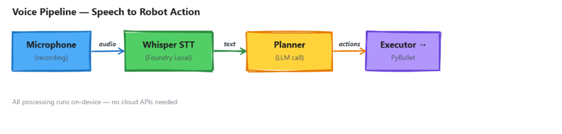

Voice mode records audio from the microphone, transcribes it locally using a
Whisper model served by Foundry Local, and then feeds the resulting text into
the same planning pipeline.

### Web UI

A **FastAPI** web server provides a browser-based interface with three panels:

- **Camera** – live view of the PyBullet simulation (auto-refreshing at 2 fps)
- **Chat** – type commands and see structured responses from the agent pipeline
- **Agent Status** – real-time cards showing each agent's progress and results

The web UI communicates via REST endpoints and a WebSocket for live updates.

---

## Prerequisites

| Requirement | Version |
|---|---|
| Python | 3.10+ |
| Foundry Local CLI | latest (`winget install Microsoft.FoundryLocal` / `brew install foundrylocal`) |
| OS | Windows, macOS, or Linux |

### Hardware notes

- **GPU recommended** for faster LLM inference but CPU works fine.
- Voice mode needs a working microphone and the `sounddevice` library (requires PortAudio on Linux: `sudo apt install libportaudio2`).

---

## Quick Start

### 1. Install Foundry Local

```bash
# Windows
winget install Microsoft.FoundryLocal

# macOS
brew tap microsoft/foundrylocal && brew install foundrylocal

# Verify
foundry --version
```

### 2. Download and start a chat model

```bash
# List available models
foundry model list

# Fastest option (~5 s per command) – recommended for interactive use
foundry model run qwen2.5-coder-0.5b

# Higher accuracy (~35 s per command)
foundry model run phi-4-mini
```

> The model server stays active in the background.  You can switch models
> at any time via the dropdown in the web UI.

### 3. (Voice mode only) Ensure Whisper model is available

The Whisper model is downloaded automatically by the `foundry-local-sdk` on
first use. No manual step needed – just make sure Foundry Local is installed.

### 4. Create virtual environment and install dependencies

The project uses a `.venv` virtual environment. Use the provided setup script
to create it, activate it, and install all dependencies in one step:

```powershell
# Windows (PowerShell) – recommended
cd robot-simulator-foundrylocal
.\setup.ps1
```

```cmd
# Windows (cmd)
cd robot-simulator-foundrylocal
setup.bat
```

```bash
# macOS / Linux
cd robot-simulator-foundrylocal
chmod +x setup.sh
./setup.sh
source .venv/bin/activate
```

<details>
<summary>Manual setup (if you prefer)</summary>

```bash
cd robot-simulator-foundrylocal
python -m venv .venv

# Activate:
#   Windows PowerShell:  .\.venv\Scripts\Activate.ps1
#   Windows cmd:         .venv\Scripts\activate.bat
#   macOS/Linux:         source .venv/bin/activate

pip install --upgrade pip
pip install -r requirements.txt
```
</details>

> **Note:** Always ensure the `.venv` is activated before running the app.
> Your prompt will show `(.venv)` when active.

### 5. Run the app

Use the provided start scripts to launch the application. The default mode
opens the **web UI** in your browser:

```powershell
# Windows (PowerShell)
.\start.ps1              # Web UI (default) → http://localhost:8080
.\start.ps1 --cli        # CLI mode instead
.\start.ps1 --no-gui     # Web UI without PyBullet window
```

```cmd
# Windows (cmd)
start.bat                # Web UI (default)
start.bat --cli          # CLI mode
```

```bash
# macOS / Linux
chmod +x start.sh
./start.sh               # Web UI (default) → http://localhost:8080
./start.sh --cli          # CLI mode
```

Or run directly with Python:

```bash
# Web UI (recommended)
python -m src.app --web

# CLI text mode
python -m src.app

# Voice mode – speak commands into the microphone
python -m src.app --mode voice

# Dry-run mode – see what the planner would do, without executing
python -m src.app --dry-run

# Custom target object
python -m src.app --object path/to/my_object.urdf

# Headless web UI (no PyBullet window)
python -m src.app --web --no-gui
```

---

## CLI Arguments

| Argument | Default | Description |
|---|---|---|
| `--mode text\|voice` | `text` | Input modality |
| `--model ALIAS` | `phi-4-mini` | Foundry Local chat model alias |
| `--whisper-model ALIAS` | `whisper-small` | Whisper model alias for voice |
| `--object PATH` | *(built-in cube)* | OBJ / STL / URDF file for the target object |
| `--record-seconds N` | `5` | Seconds of audio to record in voice mode |
| `--web` | off | Start the FastAPI web UI instead of the CLI |
| `--port N` | `8080` | Port for the web UI server |
| `--dry-run` | off | Print actions without executing |
| `--no-gui` | off | Run PyBullet headless |
| `--verbose` | off | Extra debug output |

### Environment variables

| Variable | Default | Description |
|---|---|---|
| `FOUNDRY_LOCAL_BASE_URL` | *(auto-detected via SDK)* | Override the Foundry Local endpoint (e.g. `http://127.0.0.1:5273/v1`) |
| `FOUNDRY_MODEL` | `phi-4-mini` | Chat model alias |
| `FOUNDRY_WHISPER_MODEL` | `whisper-small` | Whisper model alias |
| `INPUT_MODE` | `text` | Default input mode |
| `WEB_PORT` | `8080` | Port for the web server |

---

## Example Commands

### Text mode

```
🤖 Enter command (or 'quit'): pick up the cube
🤖 Enter command (or 'quit'): describe the scene
🤖 Enter command (or 'quit'): move to x 0.4 y 0.1 z 0.3 then open gripper
🤖 Enter command (or 'quit'): grab the blue object and place it at x 0.6 y -0.2 z 0.65
🤖 Enter command (or 'quit'): reset
🤖 Enter command (or 'quit'): quit
```

### Voice mode

Run with `--mode voice`, then speak any of the above commands when prompted.
You have 5 seconds (configurable via `--record-seconds`) to speak.

---

## Voice Input Guide

The simulator supports voice commands through **Foundry Local Whisper** — all
transcription happens on-device with zero cloud dependencies.

### How it works

```
  Browser mic ──► MediaRecorder (WebM/Opus)
       │
       ▼
  Client-side resample to 16 kHz mono WAV (OfflineAudioContext)
       │
       ▼
  POST /api/voice  (multipart form-data)
       │
       ▼
  Server: transcribe_with_chunking()
       ├── audio ≤ 30 s → single Whisper pass
       └── audio > 30 s → split into ≤ 30 s chunks, transcribe each, concatenate
       │
       ▼
  Transcribed text sent through the normal agent pipeline
  (Planner → Safety → Executor → Narrator)
```

### Prerequisites for voice

1. **A Whisper model must be cached or loaded** in Foundry Local.
   The mic button (🎤) only appears in the web UI when this condition is met.

   ```bash
   # Download a Whisper model (first time only — pick one):
   foundry model run whisper-medium       # 1.5 GB – good accuracy (recommended)
   foundry model run whisper-small        # 542 MB – faster, lighter
   foundry model run whisper-base         # 194 MB – fastest, less accurate
   ```

2. **Browser microphone permission** — the browser will prompt on first use.
   HTTPS is not required for `localhost`.

3. **CLI voice mode** additionally needs `sounddevice` + PortAudio:
   ```bash
   pip install sounddevice
   # Linux only:
   sudo apt install libportaudio2
   ```

### Using voice in the Web UI

1. Start the app: `python -m src.app --web`
2. Open http://localhost:8080
3. The 🎤 button appears next to the text input if a Whisper model is available
4. **Hold** the 🎤 button and speak your command
5. **Release** the button — the audio is sent to the server
6. The transcribed text appears in the chat as *"Heard: ..."*
7. The command is then automatically executed through the agent pipeline

> **Tip:** Keep commands under 30 seconds. Longer audio is automatically
> chunked into 30-second segments and transcribed in sequence.

### Using voice in CLI mode

```bash
python -m src.app --mode voice
# Speak when you see: 🎤 Recording for 5s – speak now …

# Longer recording window:
python -m src.app --mode voice --record-seconds 10
```

---

## Screenshots

| Overview | Reaching | Above Cube |
|---|---|---|
| 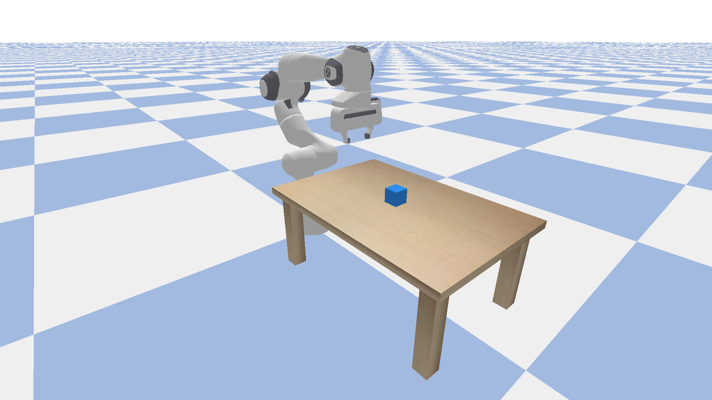 | 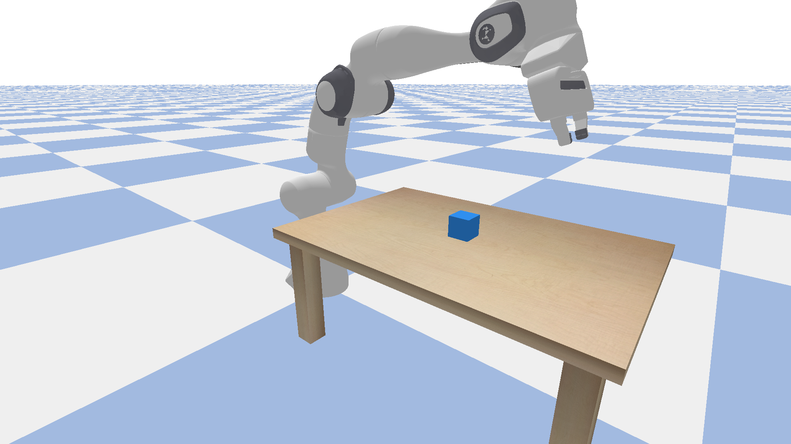 | 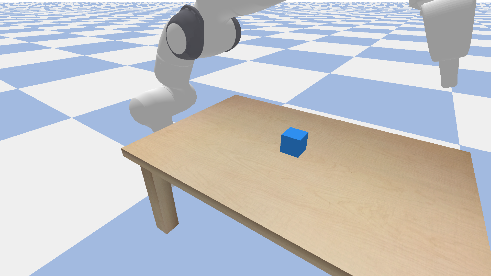 |

| Gripper Detail | Front View | Side View |
|---|---|---|
| 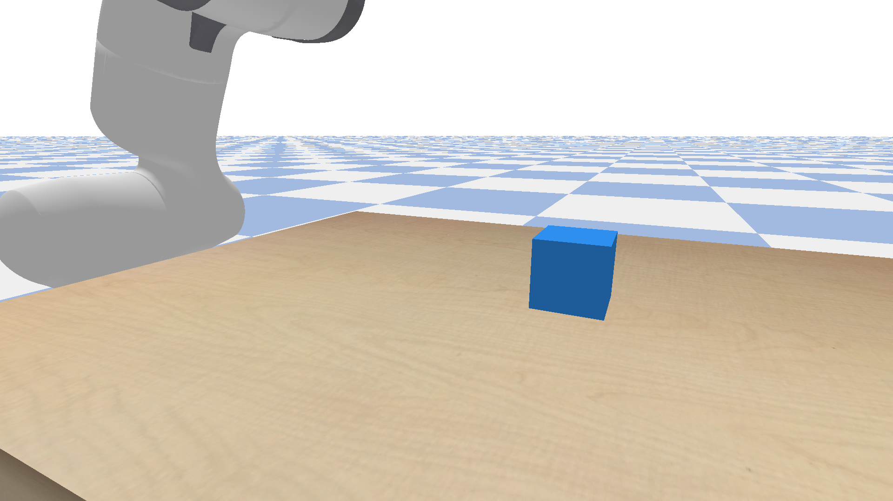 | 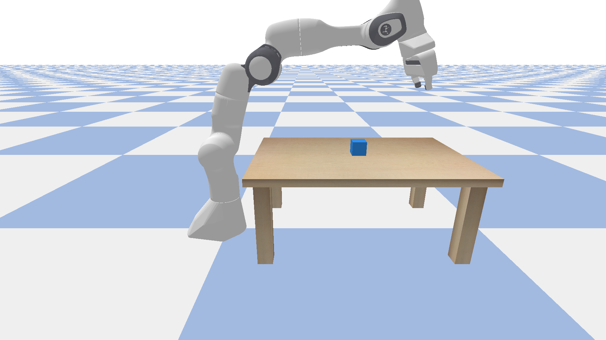 | 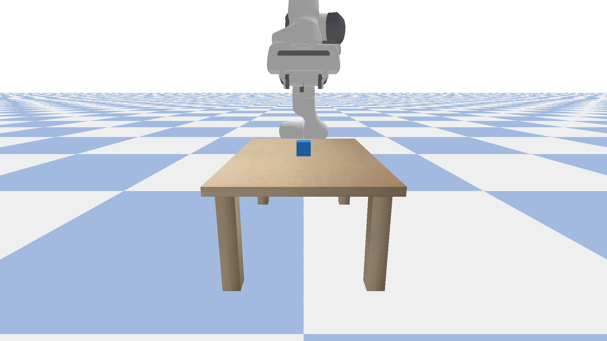 |

### App in Action

| Describe Scene | Pick Cube |
|---|---|
| 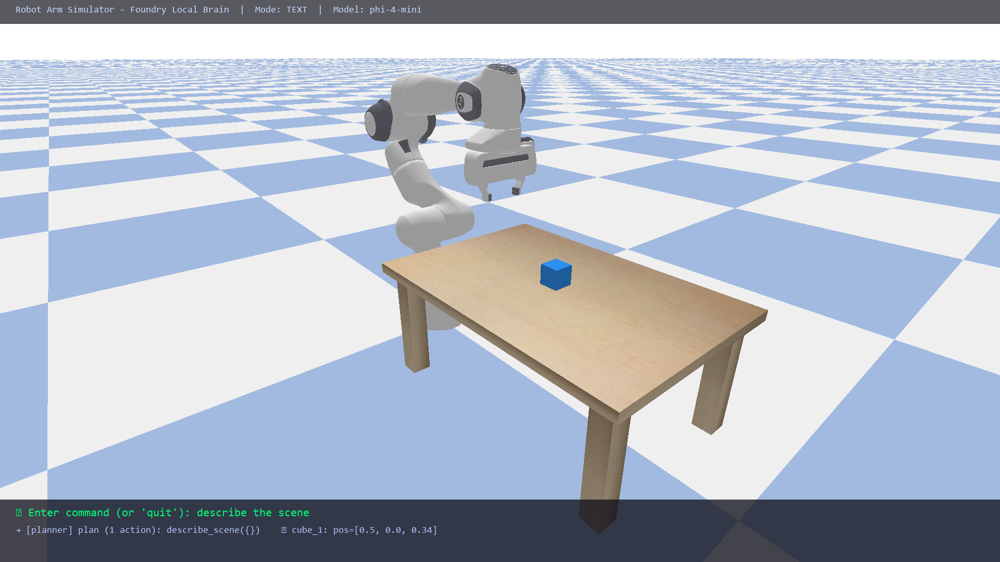 | 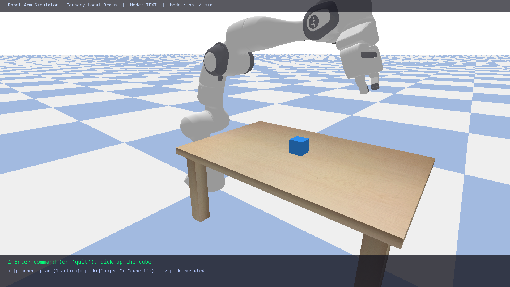 |

| Move End-Effector | Reset |
|---|---|
| 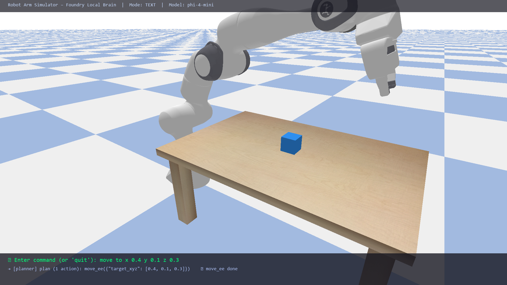 | 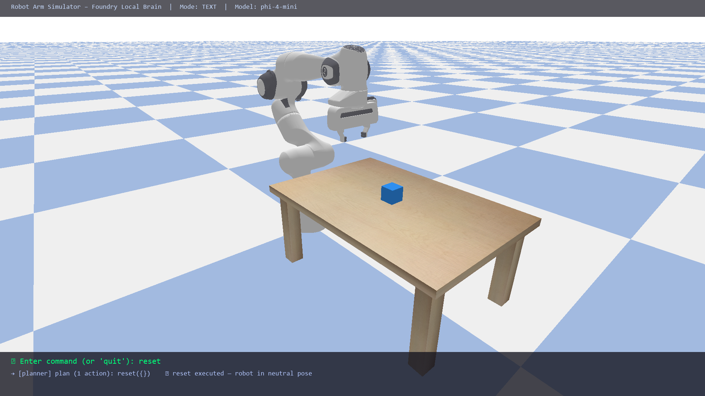 |

---

## Supported Actions

| Action | Arguments | Description |
|---|---|---|
| `move_ee` | `target_xyz` (required), `target_rpy`, `speed` | Move end-effector to a position |
| `open_gripper` | `width` (default 0.04) | Open the gripper |
| `close_gripper` | `force` (default 40.0) | Close the gripper |
| `pick` | `object` (required) | Full pick sequence: approach → descend → grip → lift |
| `place` | `target_xyz` (required) | Place the held object at a location |
| `reset` | *(none)* | Return to neutral pose, open gripper |
| `describe_scene` | *(none)* | List all scene objects and their positions |

---

## Project Structure

```
robot-simulator-foundrylocal/
├── .gitignore
├── AGENTS.md                # AI agent instructions
├── CONTRIBUTING.md          # Contribution guidelines
├── LICENSE                  # MIT licence
├── README.md
├── requirements.txt
├── setup.ps1                # Windows PowerShell setup (venv + deps)
├── setup.bat                # Windows cmd setup
├── setup.sh                 # macOS / Linux setup
├── start.ps1                # Launch app (PowerShell)
├── start.bat                # Launch app (cmd)
├── start.sh                 # Launch app (bash)
├── docs/
│   ├── gallery.html         # Screenshot gallery page
│   └── screenshots/         # Rendered PyBullet images (1920×1080)
├── tests/
│   ├── test_action_schema.py
│   ├── test_agents.py       # Agent framework tests
│   ├── test_config.py
│   ├── test_executor.py
│   ├── test_planner.py
│   ├── test_scene_helpers.py
│   └── test_render_screenshots.py
└── src/
    ├── __init__.py
    ├── __main__.py          # python -m src entry point
    ├── app.py               # main entry – CLI or web mode
    ├── config.py            # CLI args + env vars → Config
    ├── web_ui.py            # FastAPI server (REST + WebSocket + camera)
    ├── agents/
    │   ├── __init__.py
    │   ├── orchestrator.py  # Multi-agent pipeline coordinator
    │   ├── planner_agent.py # NL command → JSON action plan
    │   ├── safety_agent.py  # Validates plans against bounds & schema
    │   ├── executor_agent.py# Dispatches actions to PyBullet
    │   └── narrator_agent.py# Scene description & action narration
    ├── simulation/
    │   ├── __init__.py
    │   ├── scene.py         # ground, table, objects
    │   ├── robot.py         # Franka Panda IK + joint control
    │   └── grasp.py         # pick/place sequences
    ├── brain/
    │   ├── __init__.py
    │   ├── foundry_client.py # Foundry Local OpenAI-compat client
    │   ├── action_schema.py  # strict JSON action schema + validator
    │   └── planner.py        # NL → validated action plan via LLM
    ├── input/
    │   ├── __init__.py
    │   ├── text_input.py     # interactive CLI prompt
    │   └── voice_input.py    # mic recording + Whisper transcription
    ├── executor/
    │   ├── __init__.py
    │   └── action_executor.py # maps actions → simulation calls
    └── static/
        ├── index.html        # Web UI single-page app
        ├── style.css         # Dark-theme styles
        └── app.js            # Camera, chat, agent status logic
```

---

## Choosing a Different Model

```bash
# List all available Foundry Local models
foundry model list

# Run a different model
foundry model run phi-3.5-mini

# Tell the app to use it
python -m src.app --model phi-3.5-mini
```

The SDK auto-selects the best hardware variant (CUDA GPU → QNN NPU → CPU).

### Model Speed Comparison

Speed depends on model size and your hardware (GPU vs CPU):

| Model | Size | Inference | Best For |
|---|---|---|---|
| `qwen2.5-coder-0.5b` | 528 MB | ~4 s | Fast interactive use – recommended |
| `phi-4-mini` | 3.6 GB | ~35 s | Better accuracy, slower |
| `qwen2.5-coder-7b` | 4.7 GB | ~45 s | Best JSON accuracy, slowest |

> **Tip:** For the fastest experience, use `qwen2.5-coder-0.5b`.  You can
> switch models at any time via the dropdown in the web UI without restarting.

---

## Troubleshooting

| Problem | Solution |
|---|---|
| `cannot reach Foundry Local` | Make sure `foundry model run phi-4-mini` is running in another terminal |
| `No module named 'foundry_local'` | `pip install foundry-local-sdk` |
| `python-multipart must be installed` | `pip install python-multipart` (needed for voice upload) |
| PyBullet window doesn't open | Check your display / X11 forwarding; or use `--no-gui` |
| Voice recording fails | Install PortAudio: `sudo apt install libportaudio2` (Linux) |
| Whisper ONNX files not found | The SDK downloads them on first use – ensure internet access on first run |
| Voice transcription is slow (first time) | The Whisper ONNX pipeline is cached after the first request. Consider `whisper-small` for faster inference |
| LLM returns invalid JSON | The planner retries automatically; try rephrasing the command |

---

## License

MIT
